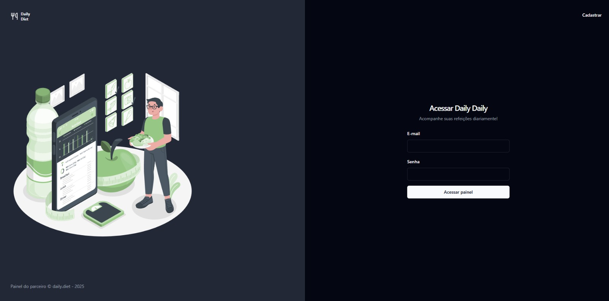
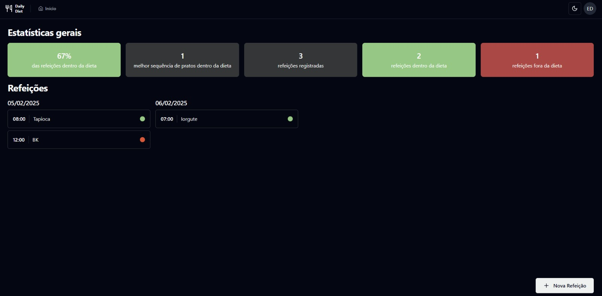
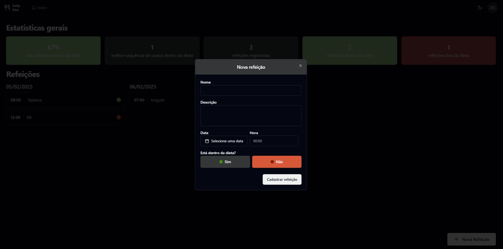
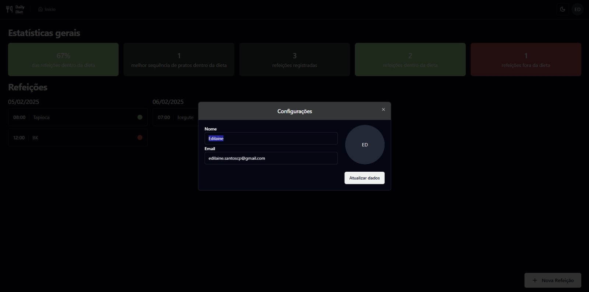
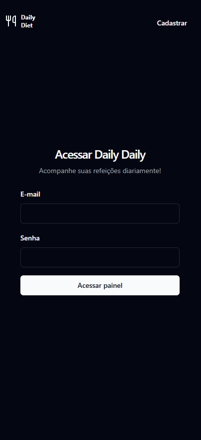
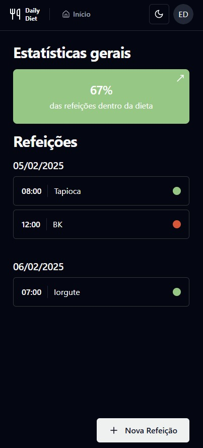
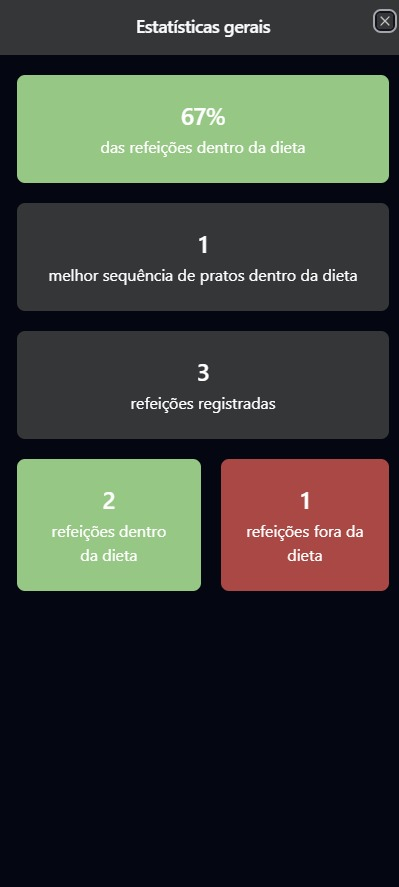
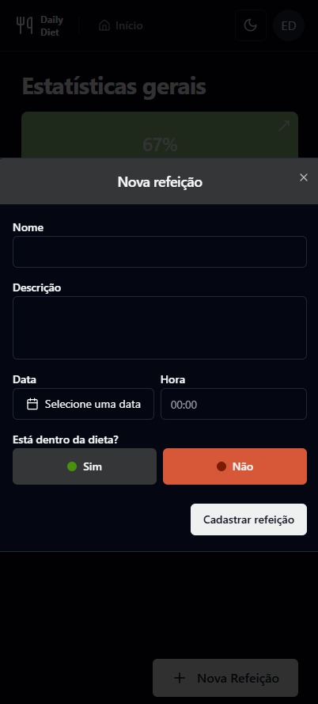
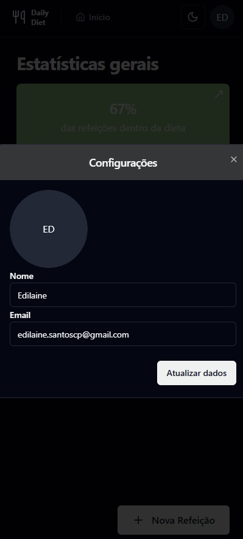

# Daily Diet

[Leia em Português](#português) | [Read in English](#english) | [Images](#images)

## English
Daily Diet is a web application for managing your daily meals. With it, you can register meals, specify times, and track whether they are within your diet. Additionally, the system provides detailed metrics to help you monitor your progress.

### 📝 Features
* Meal registration with time and status (inside or outside the diet).
* Detailed metrics:
  - Total number of registered meals.
  - Number of meals inside and outside the diet.
  - Number of consecutive meals inside the diet.
* Authentication system:
  - User creation.
  - Secure login.
 
### 🚀 Technologies Used
* React: Library for building the user interface.
* TanStack React Query: Asynchronous state management and data caching.
* TailwindCSS: Fast and efficient styling.
* React Hook Form: Form management.
* Zod: Data validation and typing.
* Radix UI: Accessible and styled components.
* Axios: Backend API communication.
* React Router DOM: Page navigation.

### 📦 Installation
1. Clone the repository
   ```
   gh repo clone edilaine-as/reactjs_dailydiet
   ```
2. Navigate to the project directory
   ```
   cd reactjs_dailydiet
   ```
3. Install dependencies
   ```
   npm i
   ```
4. Configure the .env file
   * Create a .env file in the root of the project
   * Define the VITE_API_URL variable with the address where the backend server is running.
    ```
   VITE_API_URL=http://localhost:3000
   ```
    > **Note:** To make the backend available, you need to configure and run the server. Follow the [backend installation tutorial](https://github.com/edilaine-as/NodeJS-Daily-Diet/edit/master/README.md) to complete this step.
6. Start the project
   ```
   npm run dev
   ```
### 🤝 Contribution
Feel free to contribute! Open an issue or submit a pull request.
### 📄 License
This project is licensed under the MIT License. See the LICENSE file for more details.


## Português
Daily Diet é uma aplicação web para o gerenciamento das suas refeições diárias. Com ela, você pode cadastrar refeições, especificar horários e acompanhar se estão dentro da sua dieta. Além disso, o sistema fornece métricas detalhadas para ajudá-lo a monitorar seu progresso.

### 📝 Funcionalidades
* Cadastro de refeições com horário e status (dentro ou fora da dieta).
* Métricas detalhadas:
  - Total de refeições cadastradas.
  -  Quantidade de refeições dentro e fora da dieta.
  -   Número de refeições consecutivas dentro da dieta.
* Sistema de autenticação:
  - Criação de usuário.
  - Login seguro.
### 🚀 Tecnologias Utilizadas
* React: Biblioteca para construção da interface do usuário.
* TanStack React Query: Gerenciamento de estado assíncrono e cache de dados.
* TailwindCSS: Estilização rápida e eficiente.
* React Hook Form: Gerenciamento de formulários.
* Zod: Validação e tipagem de dados.
* Radix UI: Componentes acessíveis e estilizados.
* Axios: Comunicação com a API backend.
* React Router DOM: Navegação entre páginas.

### 📦 Instalação
1. Clone o repositório:
   ```
   gh repo clone edilaine-as/reactjs_dailydiet
   ```
2. Navegue até o projeto
   ```
   cd reactjs_dailydiet
   ```
3. Instale as dependências
   ```
   npm i
   ```
4. Configure o arquivo .env
   * Crie um arquivo .env na raiz do projeto
   * Defina a variável VITE_API_URL com o endereço onde o servidor backend está rodando.
    ```
   VITE_API_URL=http://localhost:3000
   ```
    > **Nota:** Para que o backend esteja disponível, você precisa configurar e executar o servidor. Siga o [tutorial de instalação do backend](https://github.com/edilaine-as/NodeJS-Daily-Diet/edit/master/README.md) para concluir essa etapa.

6. Inicie o projeto:
   ```
   npm run dev
   ```
### 🤝 Contribuição
Sinta-se à vontade para contribuir! Abra uma issue ou envie um pull request.
### 📄 Licença
Este projeto está licenciado sob a licença MIT. Veja o arquivo LICENSE para mais detalhes.

## Images

### 💻 Desktop





### 📱 Mobile




